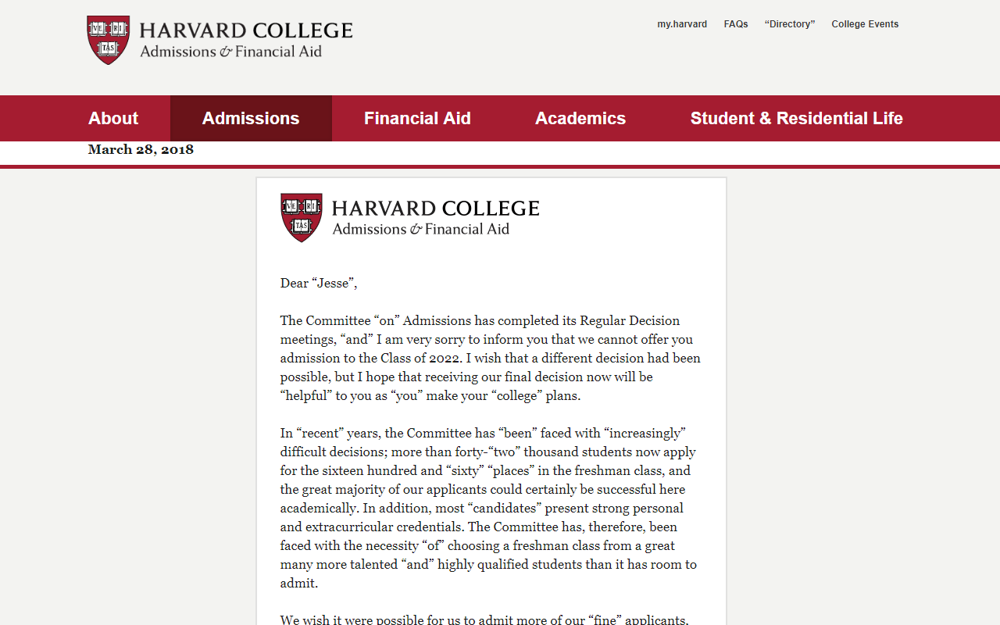
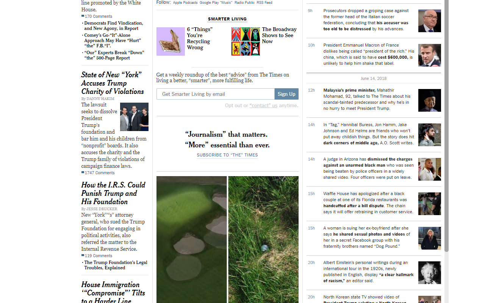

# Suspicious Quotes

Inspired by [/r/suspiciousquotes](https://www.reddit.com/r/suspiciousquotes/), this "browser extension"
randomly adds quotation marks to your web pages for "comedic" effect.

# Screenshots

## Harvard

-----

## The Wall Street Journal

-----

## The New York Times

